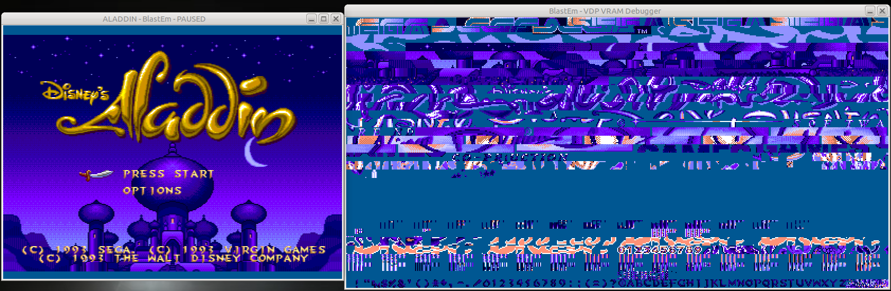
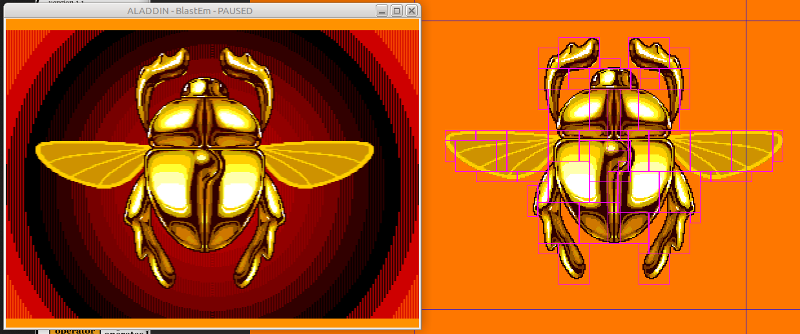
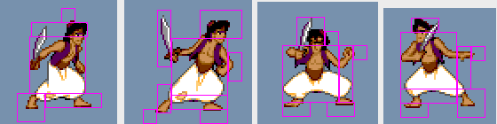

# Features for Blastem for ROM hacking greatness

Some of these features below will require changes in the genesis-hacking
repo Sprite Editor tool to be supported.

## Full screen graphic capture

Sometimes developers display a whole full screen image on the Genesis, which
would be made up of a screen of 40x28 tiles.  We want to be able to edit
these graphics with our sprite editor as well.  Create a debugger command to
grab the entire visible screen (have an option to include sprites, off by
default) tile map.  Save it into a file for our sprite editor (we may need
changes to sprite editor for the multiple color palettes required)

The following is a full screen graphic from Aladdin beta:

* [ ] Capture most of the tiles ROM addresses using DMA history
* [ ] Capture tiles missing from DMA history by using a VRAM dump of relevant
      addresses to ROM data
* [ ] Capture palette data for all tiles involved in full screen image
* [ ] Need to add multiple tile (past sprite limit) to the Sprite Editor tool
* [ ] Sprite editor needs to be able to support multiple palettes for a
      collection of sprites

## Sprite collection graphic capture

The genesis will often have many sprites next to each to form one large
character or object.  We will want to edit these sprites by presenting
them to the user in the Sprite Editor software with the correct positional
offsets as to how they are presented in game.

* [ ] Capture all sprites used in the big sprite, maybe let user select
      sprite using mouse cursor
* [ ] Some of the sprites are just mirrors of the other sprites

## Sprite animations

Often a character will have a whole set of animations.  A character can have
many frames for each action they can perform.  We would like to capture
these animation frames and sprite data for our sprite editor.

* [ ] Modifications to Sprite Editor program to handle multiple frames of an
      object
* [ ] A way to select an area of the screen and capture all sprites for a set
      of animations
* [ ] A way to reject sprites that were accidentally added to a large object
      in the sprite editor software

